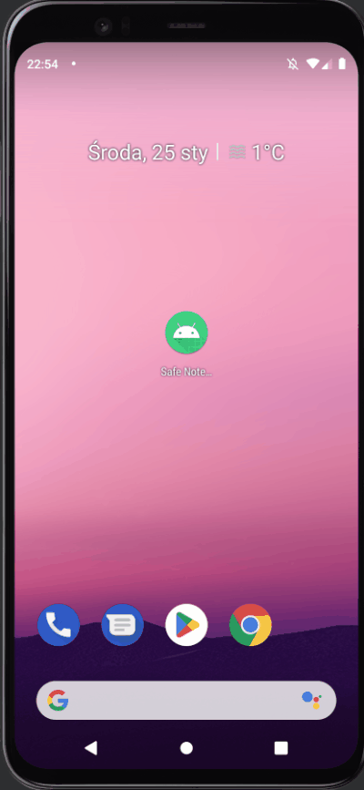

# Safe Notepad Android App

Notepad Android App secured by several cryptographic techniques.

The application allows you to securely save notes. You can access the app only by using the password or biometric authentication. The notes are saved using several cryptographic techniques, so they are also protected from reading the notes directly from the app files. If the app is onPause state, the user will be automatically taken to the password screen - to protect the notes from leaving the application minimized.

|!|**The app is now available in [Google Play Store!](https://play.google.com/store/apps/details?id=com.lukaszkoziej.safenotepad)**|!|
|-|-|-|

## What I use in this app:
- MVVM Architecture Pattern
- Room Database
- Dependency Injection with Koin
- Android Keystore
- Encrypted Shared Preferences
- Biometric authentication
- JavaX Crypto
- RecyclerView

## Demo:

## Cryptography:
Password is hashed twice using PBKDF2 with HMAC-SHA1 algorithm; the first hash (not stored anywhere) is then used as a key for cipher to encrypting/decrypting the note; the second hash is stored and used to check if typed password is correct.

## Future iterations:
- [ ] write some tests with jUnit5
